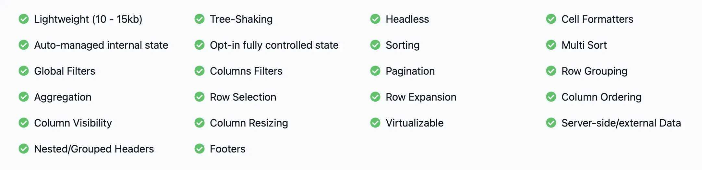

At France Université Numérique, we are developing several applications such as
[Richie](https://github.com/openfun/richie), [Marsha](https://github.com/openfun/marsha),
[Potsie](https://github.com/openfun/potsie), etc. To avoid writing duplicate and inconsistent
components, we recently decided to create our own design system called
[Cunningham](https://github.com/openfun/cunningham). We believe Cunningham will provide a more
cohesive experience for our users and streamline the development process.

This blog post aims to provide a comprehensive explanation of the decision we took regarding the
technology to use to build our component library. Our criteria included scalability, accessibility,
customization, and open source availability.

At the outset, we identified three approaches for constructing our component library:

- Utilizing a **component library**
- Developing **components from scratch**
- Implementing **headless components**

Let’s dive in ! 🧐

## The three paths considered to develop Cunningham

### Straight to the point

Ask a frontend developer to create a design system and there’s a lot of chances that he will pick
MUI, or any equivalent well known component library. In a lot of cases that’s a really wise choice,
but you need to be aware of some potential caveats that can occur over the long run.

Such libraries offer ready-to-use components that allow any developers to ship fast working
components. You can also quickly fine tune the components UI by passing a custom configuration to
change the default colors to fit your brand.

Even if those libraries have lots of advantages we identified some eventual high risk problems. You
can customize lots of things in each components but you cannot customize everything, here is an
example: How do you add a `div` to render some information in a deeply nested element into an
existing component?

- If you are lucky the component already have options to customize some parts of the rendering.
- Otherwise, you’ll have to deal without it. And that’s sad :(

That’s what we call the “Wall Effect”, it names the situation where you decided to choose a
component library (like MUI) at the start, into which you invested lots of efforts customizing the
configuration to make it fit your desired UI and then at some point you realized that you have an
important need that the component CANNOT satisfy. And then you end in a situation where you have no
other choice but to change the library or to re-write such a component from scratch. In a minute
you’ve lost all your investment like a car crashing in a wall in the middle of the highway.

There is another solution where you can also contribute to the existing components library but the
learning curve of large libraries like MUI is important, and you are not guaranteed that your
proposal will be accepted (and that’s totally fair).

In some cases the missing feature you need might already be included into the paying version of the
library, and adding those in a forked repository might cause some obvious issues regarding the
commercial strategy of the library. Even if we wanted to buy the paying version, there would be some
licensing issues because our code is licensed under MIT and the paying versions of those libraries
are not, for obvious reasons.

### The hard way

And … why not code our components from scratch? Just with plain Vanilla Javascript. Well, sometimes
it’s fun to develop components from scratch, like turning raw materials into nice objects.

Well, we had the constraint to ship a first version of a Data Table quite quickly, which can be an
incredibly difficult subject considering numerous features and accessibility constraints. Creating
such a component from scratch with lots of features can take weeks considering:

- Pagination
- Rows selection
- Responsiveness
- Resizable columns
- Columns grouping
- Sorting
- Collapsible rows
- Spanning
- Virtualization
- Etc ..

.. And we’re not even talking about browser compatibilities.

Creating hard components from scratch requires a lot of initial investment, but not only. It also
requires a permanent investment to maintain those to browser updates and also to some exotic devices
for instance. And let’s be honest, as developers our first job is to NOT reinvent the wheel.

We thought there might be another approach that can offer the perfect balance between customization
and development efforts.

### The way of the cunning

And what if there is an intermediate approach more flexible than library components but without the
chore of rewriting all components from scratch?

It’s time to talk about Headless components!

Headless components are a type of library that provide logic, state, processing and API for UI
elements and interactions but do not provide markup, styles or pre-built implementations. This means
that it is possible to create a fully featured and accessible data table without having to start
from scratch and spending months to develop it. Headless component libraries, like react-table,
offer all the features that you would expect from a data table, so that you can focus solely on the
[“front-of-the-front” without having to worry about the “back-of-the-front”](https://bradfrost.com/blog/post/front-of-the-front-end-and-back-of-the-front-end-web-development/).

#### Go for a walk

Here is an example of a basic data table developed through react-table.

```tsx
import * as React from 'react'
import ReactDOM from 'react-dom/client'
import type { Person } from './types';

import {
  createColumnHelper,
  flexRender,
  getCoreRowModel,
  useReactTable,
} from '@tanstack/react-table'

const defaultData: Person[] = [
  {
    firstName: 'tanner',
    lastName: 'linsley',
    age: 24,
    visits: 100,
    status: 'In Relationship',
    progress: 50,
  },
	...
]

const columnHelper = createColumnHelper<Person>()

const columns = [
  columnHelper.accessor('firstName', {
    cell: info => info.getValue(),
    footer: info => info.column.id,
  }),
	...
]

export function BasicDataTable() {
  const [data, setData] = React.useState(() => [...defaultData])
  const rerender = React.useReducer(() => ({}), {})[1]

  const table = useReactTable({
    data,
    columns,
    getCoreRowModel: getCoreRowModel(),
  })

  return (
    <table>
      <thead>
        {table.getHeaderGroups().map(headerGroup => (
          <tr key={headerGroup.id}>
            {headerGroup.headers.map(header => (
              <th key={header.id}>
                {header.isPlaceholder
                  ? null
                  : flexRender(
                      header.column.columnDef.header,
                      header.getContext()
                    )}
              </th>
            ))}
          </tr>
        ))}
      </thead>
      <tbody>
        {table.getRowModel().rows.map(row => (
          <tr key={row.id}>
            {row.getVisibleCells().map(cell => (
              <td key={cell.id}>
                {flexRender(cell.column.columnDef.cell, cell.getContext())}
              </td>
            ))}
          </tr>
        ))}
      </tbody>
      <tfoot>
        {table.getFooterGroups().map(footerGroup => (
          <tr key={footerGroup.id}>
            {footerGroup.headers.map(header => (
              <th key={header.id}>
                {header.isPlaceholder
                  ? null
                  : flexRender(
                      header.column.columnDef.footer,
                      header.getContext()
                    )}
              </th>
            ))}
          </tr>
        ))}
      </tfoot>
    </table>
  )
}
```

You can split the logic in two parts :

1. **Setup your table** : Prepare your data, columns structure and row models to provide to the hook
   `useReactTable`
2. **Build your interface :** The hook set up previously offers methods to get header, row, cell and
   footer data.

And that’s all ! Need a pagination, a filtering column, to stick the header? All those things can be
configured.

|  |
| :---------------------------------------------------------------------------------: |
|   All features currently offered by [react-table](https://tanstack.com/table/v8).   |

Of course, before picking a headless component library developer should ensure that it can address
all the needs. Moreover, this kind of library is often concerned about accessibility that is not
something easy to address properly and can be really time-consuming. Then in comparison to library
components, the offer and the community can be smaller but this means contributing to this
eco-system can be simpler. Finally, Headless components can ease discussions between developer and
designer as once identified, the headless library defines a feature scope and at the same time do
not constraint the creativity of designer about look’n feel.

## Conclusion

At first, to be honest we were prone to use a components library like MUI but after brainstorming on
the pros and cons of each approach we realized that the drawbacks of this choice were too big for
us, the risk-reward balance is not safe enough for us considering the “Wall Effect”.

We felt more comfortable to use a small collection of headless libraries to build our design system,
this way we are sure that we will be totally free to make any UI changes without being stuck at some
point in the future even if they imply a bit more investment at the start.
