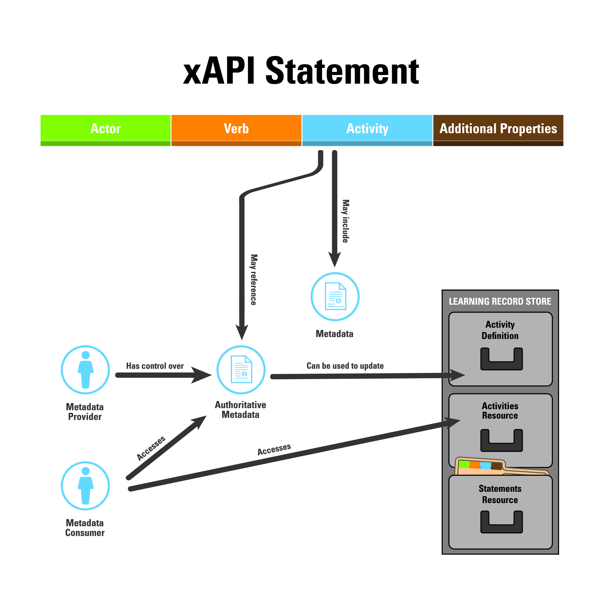

Activities are a backbone of the xAPI specification and of learning systems across the universe 💫.
The specification defines different ways of describing them giving them the power to travel through
space and time!

In this blog post we’ll shed some light on this fascinating process and discuss the terms of
**activity**, **activity definition**, **activity metadata**, and (for the bravest) the final boss
👾 : **canonical activity definition**.

As a bonus, when you'll finish reading this blog post you'll be able to fully understand the
following xAPI diagram summarizing interactions between different activities source! 😎

_[xAPI metadata diagram](https://github.com/adlnet/xAPI-Spec/blob/master/xAPIMetadata.jpg)_

> This post will cite the xAPI specification extensively. Every sentence written in _italic_ is a
> direct xAPI specification citation.

Buckle up! 💪

## Some context 📖

### The Experience API

We suppose the reader to be familiar with the existence of the
[Experience API (xAPI)](https://github.com/adlnet/xAPI-Spec) and to some extent to the concept of
[xAPI statement](https://github.com/adlnet/xAPI-Spec/blob/master/xAPI-About.md#def-statement).

> For french readers, take a look at the blog of our friend
> [Sébastien Fraysse](https://www.learningdata.fr/xapi-en-bref/) who did a terrific job at making
> the learning data world understandable and ... enchanting!

The Experience API (xAPI) is the international standard for learning data.  
In their own words it's _a technical specification that aims to facilitate the documentation and
communication of learning experiences_.

It is open source and can be found on [GitHub](https://github.com/adlnet/xAPI-Spec).

### Document scope

We're going to discuss the concepts behind the xAPI representation of activities and what it means
to
[Learning Record Producers](https://github.com/adlnet/xAPI-Spec/blob/master/xAPI-About.md#def-learning-record-provider)
(LRP, like [marsha](https://github.com/openfun/marsha)),
[Learning Record Stores](https://github.com/adlnet/xAPI-Spec/blob/master/xAPI-About.md#def-learning-record-store)
(LRS, like [ralph](https://github.com/openfun/ralph)) and
[Learning Record Consumers](https://github.com/adlnet/xAPI-Spec/blob/master/xAPI-About.md#def-learning-record-consumer)
(LRC, like [warren](https://github.com/openfun/warren)). We'll try to make the concept of activity
clearer for all parties so that anyone can make enlightened decisions about how to share or query
activity definitions and metadata!

### TL;DR

The term `activity` appears in different sections of the specification and the different concepts
introduced by the specification are somewhat intertwined with one another. To make the following
explanations easier to grasp, we'll present them step by step according to the masterful plan below:

- What is an activity according to the specification?
- How is an activity represented? That is, what is its format/structure?
- Where can we find an activity's definition or additional metadata?
- How different activity definition sources interact with each other to produce an accurate activity
  representation?

## The xAPI activity ⚽

Let's start with a philosophical question: what exactly is ~~life~~ an activity?

According to the specification, an activity is
[_a type of Object making up the "this" in "I did this"_](https://github.com/adlnet/xAPI-Spec/blob/master/xAPI-About.md#def-activity).
_In the Statement "Anna tried a cake recipe 🎂", the recipe constitutes the Activity in terms of the
xAPI Statement._

From a learning record producer (LRP) point of view, activities will often solely exist in xAPI
statements; statements being the only way to transmit activities to a Learning Record Store (LRS).
We'll see that from an LRS or LRC point of view, things can get more involved.

## The activity recipe 🥮

An activity is **always** expressed following the structure of an
[**activity definition**](https://github.com/adlnet/xAPI-Spec/blob/master/xAPI-Data.md#activity-definition)

The activity definition must not be mistaken for the concept of activity
[metadata](https://github.com/adlnet/xAPI-Spec/blob/master/xAPI-Data.md#30-metadata) even though
both terms are overlapping. The specification does not express this difference precisely but here is
an attempt in plain, technical English:

- an activity definition describes the **structure** of an activity. The activity definition is
  mentioned in details in the specification when
  [describing the statement structure](https://github.com/adlnet/xAPI-Spec/blob/master/xAPI-Data.md#activity-definition)
- activity [metadata](https://github.com/adlnet/xAPI-Spec/blob/master/xAPI-Data.md#30-metadata) is a
  term that indicates that activity metadata is hosted by an external source **but must also follow
  the activity definition structure**. In the last part we'll see that the LRS must maintain an
  internal canonical activity definition 👾 where it MAY merge different sources of activity
  definition (from multiple statements and/or a metadata provider)

🔎 TL;DR: activity metadata is expressed as an activity definition but the term indicates a third
party origin (as opposed to xAPI statements and / or the LRS canonical activity
definition -[see below](#canonical-activity-definition-))

🔎 _Nota bene_ : it is also possible to store **unstructured** data about an activity, and we'll
give you more details about this
[below](#in-the-activity-profile-resourcehttpsgithubcomadlnetxapi-specblobmasterxapi-communicationmdactprofres).

## Shopping for activities 🛒

### Activity definitions

Activity definitions are found in multiple places and can be merged in different ways according both
to the LRS xAPI specification and implementation.

#### In xAPI statements

This is the most common place for activity definition.  
Activity definitions are found in two places inside a statement:

**📌 In the `object` property**

Only
[when the `ObjectType` is an `Activity`](https://github.com/adlnet/xAPI-Spec/blob/master/xAPI-Data.md#2441-when-the-objecttype-is-activity),
(actually the most common case with statements) the activity definition is found in the `definition`
property of the `object`. This means `statement.object.definition` is an activity definition (big up
if you deducted that yourself 😉).

Here is a typical xAPI statement with an objet being an activity :

```json
{
  "verb": {
    "id": "http://adlnet.gov/expapi/verbs/initialized",
    "display": {
      "en-US": "initialized"
    }
  },
  "id": "3a8d68f6-b780-4fa4-af52-4d1c9c36c034",
  "actor": {
    "objectType": "Agent",
    "account": {
      "name": "63580581-c18b-40ce-98e2-8a3dec10c114",
      "homePage": "http://fun-mooc.fr"
    }
  },
  "object": {
    "definition": {
      "type": "https://w3id.org/xapi/video/activity-type/video",
      "name": {
        "en-US": "FUN-c05dccf5-8ec2-55e4-a04f-2fde2dd985df"
      }
    },
    "id": "uuid://8d386f48-3baa-4acf-8a46-0f2be4ae243e",
    "objectType": "Activity"
  },
  "timestamp": "2023-07-12T23:58:15.955135+00:00"
}
```

**📌 In the `context` property**

The statement optional `context` can have a `contextActivities` property that is _A map of the types
of learning activity context that this Statement is related to.
[Valid context types are](https://github.com/adlnet/xAPI-Spec/blob/master/xAPI-Data.md#2462-contextactivities-property:~:text=A%20map%20of%20the%20types%20of%20learning%20activity%20context%20that%20this%20Statement%20is%20related%20to.%20Valid%20context%20types%20are%3A%20parent%2C%20%22grouping%22%2C%20%22category%22%20and%20%22other%22):
"parent", "grouping", "category" and "other"_

According to the specification : _many Statements do not just involve one (Object) Activity that is
the focus, but relate to other contextually relevant Activities. The "contextActivities" property
allows for these related Activities to be represented in a structured manner._

Statements matching these activities can be queries via a HTTP GET requests to the LRS on the
`/xAPI/statements` endpoint by setting the query parameter
[`related_activities`](https://github.com/adlnet/xAPI-Spec/blob/master/xAPI-Communication.md#:~:text=Apply%20the%20Activity,the%20%22activity%22%20parameter.)
to True. The response will _include statements for which the Object, any of the context Activities,
or any of those properties in a contained SubStatement match the Activity parameter._

The above statement could reference the fun mooc course `course-v1:FUN+115+session01` as a parent
activity like so :

```json
{
  "verb": {
    "id": "http://adlnet.gov/expapi/verbs/initialized",
    "display": {
      "en-US": "initialized"
    }
  },
  "id": "3a8d68f6-b780-4fa4-af52-4d1c9c36c034",
  "actor": {
    "objectType": "Agent",
    "account": {
      "name": "63580581-c18b-40ce-98e2-8a3dec10c114",
      "homePage": "http://fun-mooc.fr"
    }
  },
  "object": {
    "definition": {
      "type": "https://w3id.org/xapi/video/activity-type/video",
      "name": {
        "en-US": "FUN-c05dccf5-8ec2-55e4-a04f-2fde2dd985df"
      }
    },
    "id": "uuid://8d386f48-3baa-4acf-8a46-0f2be4ae243e",
    "objectType": "Activity"
  },
  "context": {
    "contextActivities": {
      "parent": [
        {
          "id": "https://lms.fun-mooc.fr/courses/course-v1:FUN+115+session01",
          "objectType": "Activity",
          "definition": {
            "type": "http://adlnet.gov/expapi/activities/course"
          }
        }
      ]
    }
  },
  "timestamp": "2023-07-12T23:58:15.955135+00:00"
}
```

### [Activities resource](https://github.com/adlnet/xAPI-Spec/blob/master/xAPI-Communication.md#22-document-resources:~:text=The%20Activities%20Resource%20provides%20a%20method%20to%20retrieve%20a%20full%20description%20of%20an%20Activity%20from%20the%20LRS)

As well as the statements resource, the xAPI specification defines other
[resources](https://github.com/adlnet/xAPI-Spec/blob/master/xAPI-Communication.md#20-resources)
including the activities resource. _The Activities Resource provides a method to retrieve a full
description of an Activity from the LRS._

The request will return the **canonical activity definition** 👾 of the LRS. We'll explain this
concept [below](#canonical-activity-definition-).

For example, executing an HTTP GET request to `/activities` :
`curl localhost/activities?activityId=http://funcourse` could return

```json
{
  "definition": {
    "type": "https://w3id.org/xapi/video/activity-type/video",
    "name": {
      "en-US": "FUN-c05dccf5-8ec2-55e4-a04f-2fde2dd985df"
    }
  },
  "id": "uuid://8d386f48-3baa-4acf-8a46-0f2be4ae243e",
  "objectType": "Activity"
}
```

The endpoint for this resource
[only _returns_ data, and it can only be accessed with the GET command](https://adlnet.gov/projects/xapi/#:~:text=and%20usage%20instructions.-,This%20endpoint%20only%20returns%20data,-%2C%20and%20it%20can)

### [Metadata providers](https://github.com/adlnet/xAPI-Spec/blob/master/xAPI-Data.md#30-metadata)

The activity id, an IRI, can optionally resolve to an URL hosted by an external service (like an
LMS) that defines an **authoritative metadata** (scary too! [see below](#authoritative-metadata-)).
The activity metadata should be structured according to the
[activity definition](#the-activity-recipe-)

### Unstructured activity data

Because the structure of the activity definition can feel a bit tight around the shoulders, the xAPI
specification makes it possible to store miscellaneous activity metadata in two different places.

#### 1. In the activity definition

- The `moreinfo` property _resolves to a document with human-readable information about the
  Activity, which could include a way to launch the activity. It could be hosted by the LRS or by a
  third party._
- The [`extensions`](https://github.com/adlnet/xAPI-Spec/blob/master/xAPI-Data.md#41-extensions)
  property allows activity properties to be extended and exploited by a single application or a
  Community of Practice.

#### 2. In the [activity profile resource](https://github.com/adlnet/xAPI-Spec/blob/master/xAPI-Communication.md#actprofres)

This resource is a
[document resource](https://github.com/adlnet/xAPI-Spec/blob/master/xAPI-Communication.md#22-document-resources)
that allows Learning Record Providers (LRP) to save arbitrary data in the form of documents. It is
the ultimate scratchpad for activities. Put everything you want there (including cakes 🍰)!

## The activity's canon 💣

Now we've reviewed every single place an activity can be described, let's put the last nail in the
coffee and explain how these different sources can ... make the activity definition evolve with
time!

You read that right! Even though xAPI statements are
[**immutable**](https://github.com/adlnet/xAPI-Spec/blob/master/xAPI-Data.md#statement-immutability-and-exceptions),
two xAPI concepts make it possible to update an activity definition and backport (or not) this
changes into existing xAPI statements.

You knew this moment would come... yeah it's time to confront two monsters of the xAPI
specification!  
Prepare your poke bowl and let me unleash in the arena:

- the **canonical activity definition** 👾 as well as its little brother
- the **authoritative metadata** 🐙!

Let's clarify these two terms and finally understand the way an activity definition can evolve with
time.

### Canonical activity definition 👾

In addition to store statements an LRS is supposed to separately maintain a **canonical activity
definition** for each new activity. The idea behind this is twofold:

- allow Learning Record Consumers to query the canonical activity definition by using the
  [Activities Resource endpoint](#activities-resourcehttpsgithubcomadlnetxapi-specblobmasterxapi-communicationmd22-document-resourcestextthe20activities20resource20provides20a20method20to20retrieve20a20full20description20of20an20activity20from20the20lrs)
- allow the LRS to return an up-to-date activity definition in
  [previous statements](https://github.com/adlnet/xAPI-Spec/blob/master/xAPI-Data.md#statement-immutability-and-exceptions:~:text=Activity%20Definitions%20referenced%20by%20a%20Statement.%20The%20content%20of%20Activity%20Definitions%20that%20are%20referenced%20in%20Statements%20is%20not%20considered%20part%20of%20the%20Statement%20itself)
  (using the `canonical` parameter of `/xAPI/statements` or by default)

This **canonical activity definition** may be updated by incorporating the activity definition
expressed in more recent
[statements](https://github.com/adlnet/xAPI-Spec/blob/master/xAPI-Data.md#lrs-requirements-1).

It may also incorporate the definition hosted by a **metadata provider**.

The LRS is free to pick which definition to choose!

### Authoritative metadata 🐙

A
[metadata provider](#metadata-providershttpsgithubcomadlnetxapi-specblobmasterxapi-datamd30-metadata),
can host activity metadata. This metadata is considered by the specification as **authoritative
metadata** and serves two purposes:

- allow a third party (like a Learning Record Consumer) to look it up to get the most recent version
  of the activity definition
- be exploited by an LRS when it acts as a
  [metadata consumer](https://github.com/adlnet/xAPI-Spec/blob/master/xAPI-About.md#def-metadata-consumer)
  and
  [_incorporate the loaded definition into its canonical definition for that Activity, while preserving names or definitions not included in the loaded definition_](https://github.com/adlnet/xAPI-Spec/blob/master/xAPI-Data.md#lrs-requirements-5)

Another mouthful. 😆

## Conclusion

Congrats to the brave readers that followed along this somewhat arduous subject! They can now fully
understand the introduction diagram. ✌️

In this post we've learnt about :

- activities : what they are and how are they specified
- who uses them and how they can be queried
- what is a canonical activity definition and why it matters

Cheers and let's hope we'll meet again to explore together the magical world of xAPI and digital
learning! 👋
